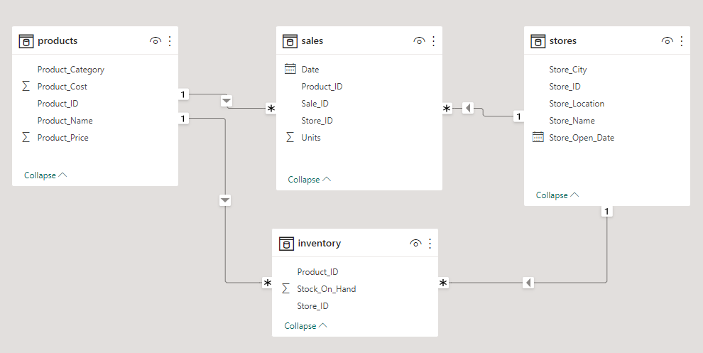

# SQL-Data-Analysis

## Maven Toys Operational Insights

The project entailed utilizing PostgresSQL to establish a relational database, importing relevant datasets, and generating various reports to address diverse business questions. 

These queries encompass identifying; 
- Product categories with biggest profits across store locations
- Amount of money tied up in inventory at toy stores and how long it will last.
- Sales lost with out-of-stock products at certain locations

## Database and Tool
- PostgreSQL
- PgAdmin4

Entity-Relationship Diagram (ERD): Maven Toys Database

